# Active Directory RBAC Homelab

## Overview
This project is a Windows Active Directory homelab built to simulate a small enterprise environment. The lab includes a Domain Controller and a domain-joined client machine, along with organizational units, security groups, bulk-created users, and shared folder permissions based on role-based access control (RBAC).

The goal of this lab was to practice core Active Directory administration tasks such as user provisioning, OU design, group-based access control, and validating authorization through shared folder permissions.

---

## Lab Objectives
- Build a Windows Active Directory environment in VirtualBox
- Configure a Domain Controller and a domain-joined client
- Bulk-create 100 domain users using PowerShell
- Organize users into department-based OUs
- Create department-based security groups
- Assign users to groups based on department
- Create shared folders for each department
- Apply both share permissions and NTFS permissions
- Validate successful and denied access to department shares

---

## Lab Environment

### Virtual Machines
- **Server VM**: Windows Server acting as the Domain Controller
- **Client VM**: Windows workstation joined to the domain

### Network
- **Domain Controller IP**: `192.168.10.10`
- **Client IP**: `192.168.10.11`

The client machine was configured to use the Domain Controller as its preferred DNS server to support Active Directory authentication and name resolution.

---

## Topology

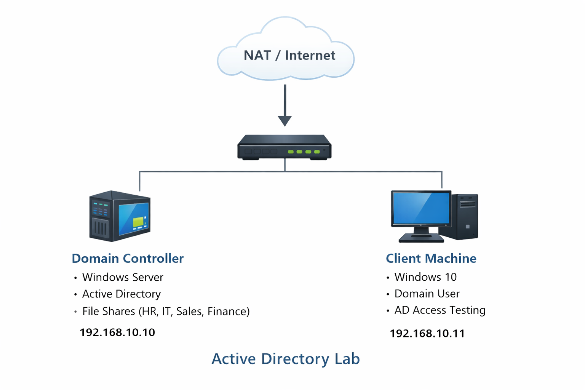

---

## Virtual Machine Configuration

### Server VM
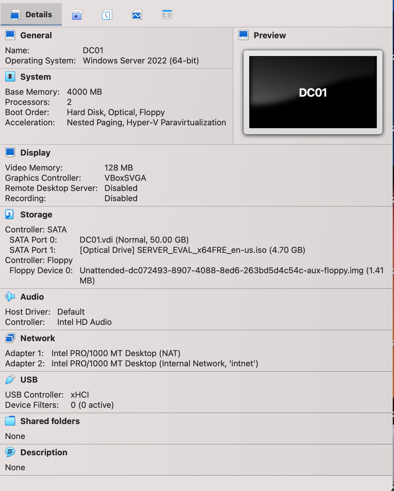

### Client VM
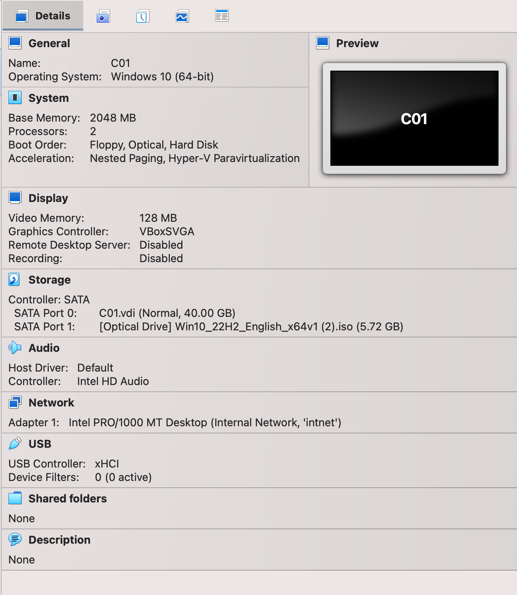

---

## Active Directory Installation
Active Directory Domain Services was installed on the server, and the machine was configured as the Domain Controller for the lab environment.

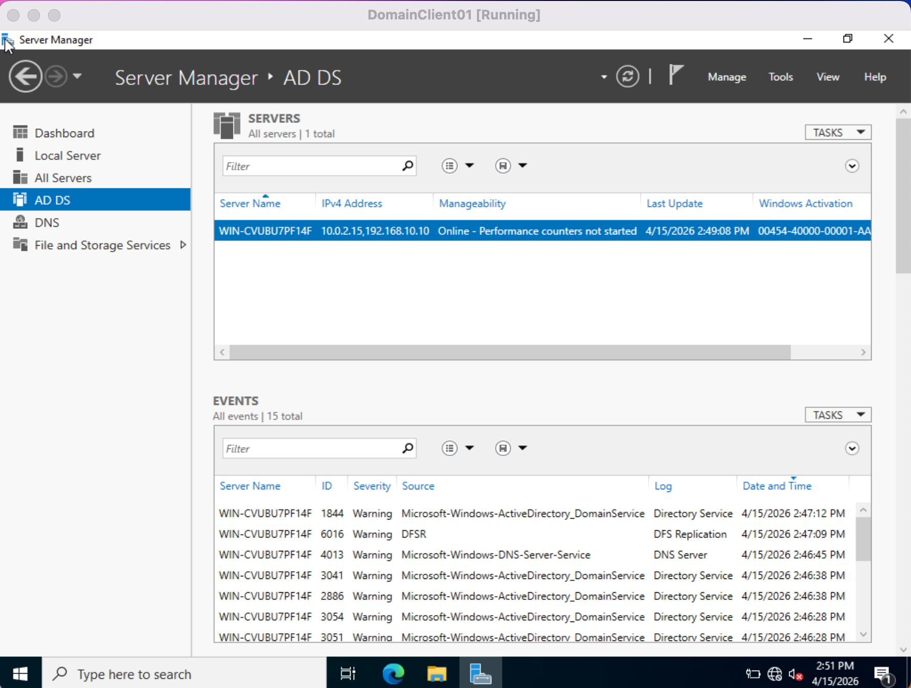

---

## Bulk User Provisioning with PowerShell
To simulate an enterprise environment at scale, I used a PowerShell script to create 100 domain user accounts.

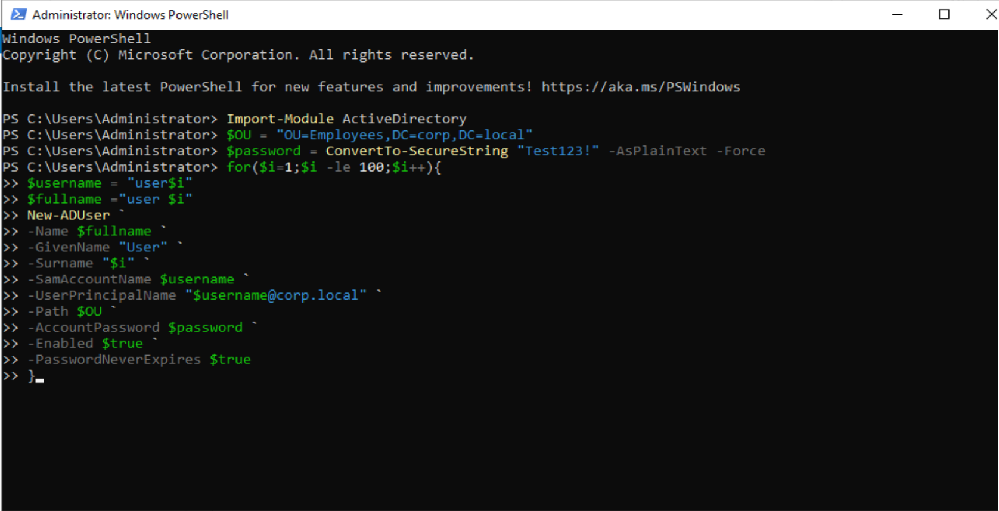

After the script completed, the users were visible in Active Directory.

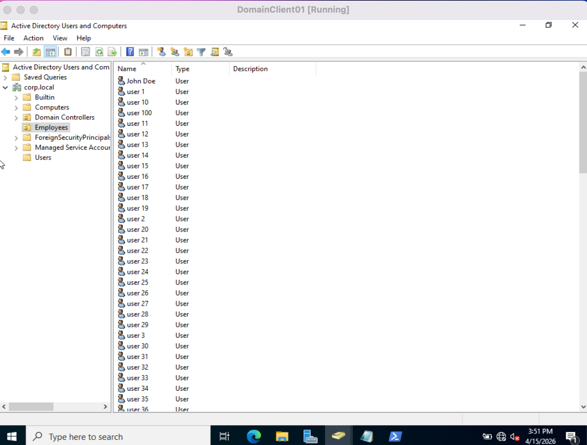

---

## Organizational Unit Design
To keep the environment organized, I created department-based OUs under the `Employees` OU:
- HR
- IT
- Sales
- Finance

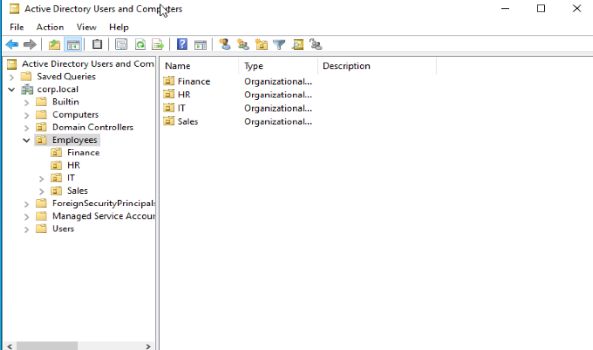

---

## Security Groups
I created department-based security groups to support role-based access control:
- `HR_Users`
- `IT_Users`
- `Sales_Users`
- `Finance_Users`

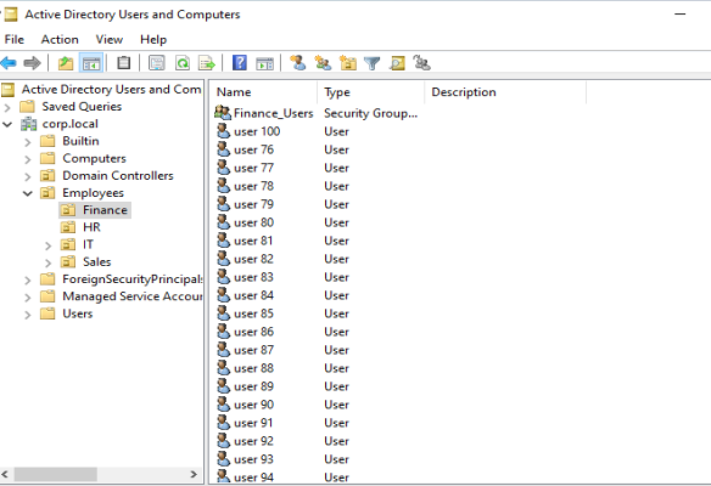

---

## Group Membership
Users were assigned to the appropriate department security groups to reflect role-based authorization.

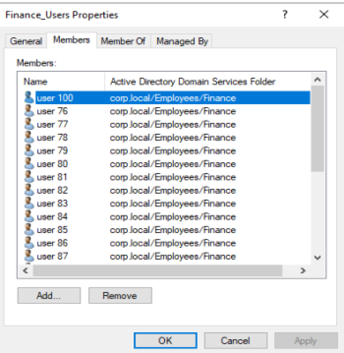

---

## Shared Folder Structure
I created department-specific shared folders on the Domain Controller:

- `C:\Shares\HR`
- `C:\Shares\IT`
- `C:\Shares\Sales`
- `C:\Shares\Finance`

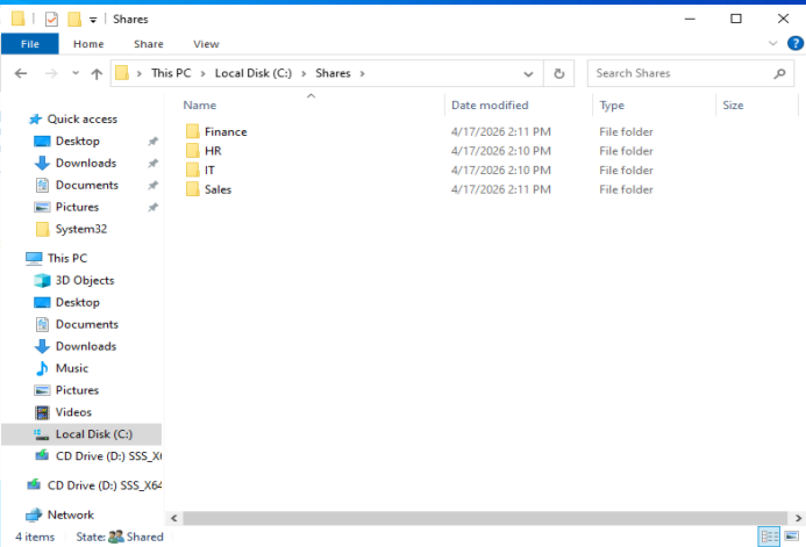

---

## Share Permissions
Each department folder was shared and configured with the matching department security group.

Example: the HR share was configured with the `HR_Users` group.

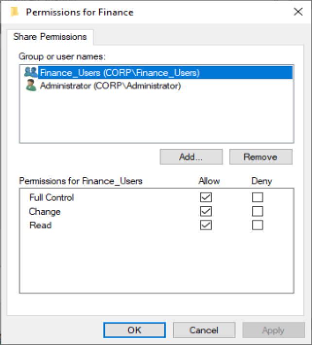

---

## NTFS Permissions
In addition to share-level permissions, I configured NTFS security permissions on each folder to enforce access control at the file system level.

This ensured users only received the access allowed by the combination of sharing permissions and NTFS permissions.

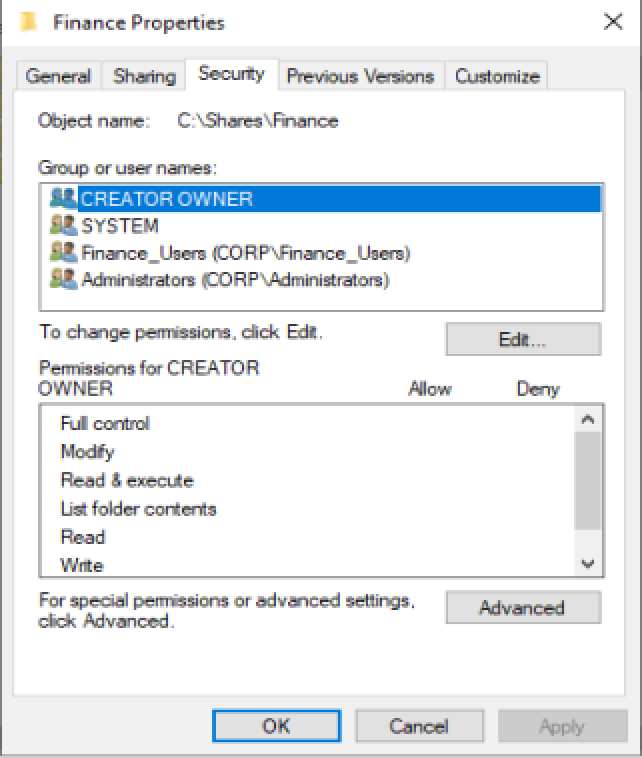

---

## Access Validation

### Successful Access
I tested the environment by signing in with an authorized user and verifying successful access to the correct departmental share.

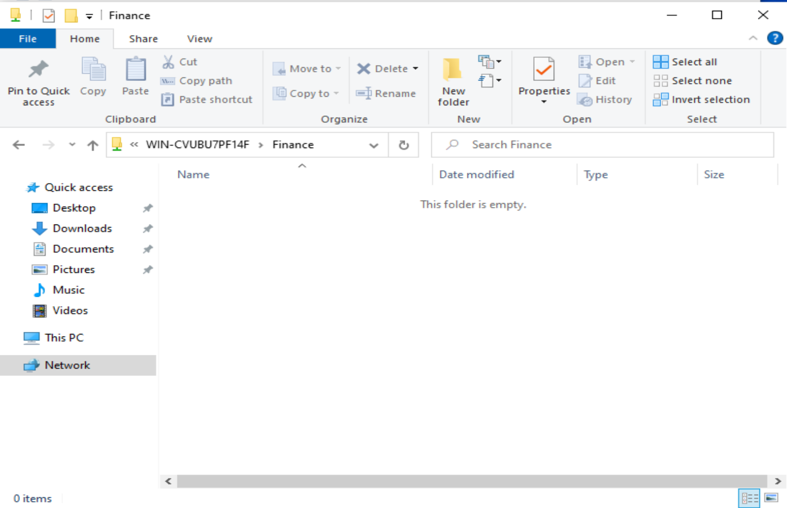

### Denied Access
I also tested unauthorized access by attempting to open a department share with the wrong user, confirming that access was denied.

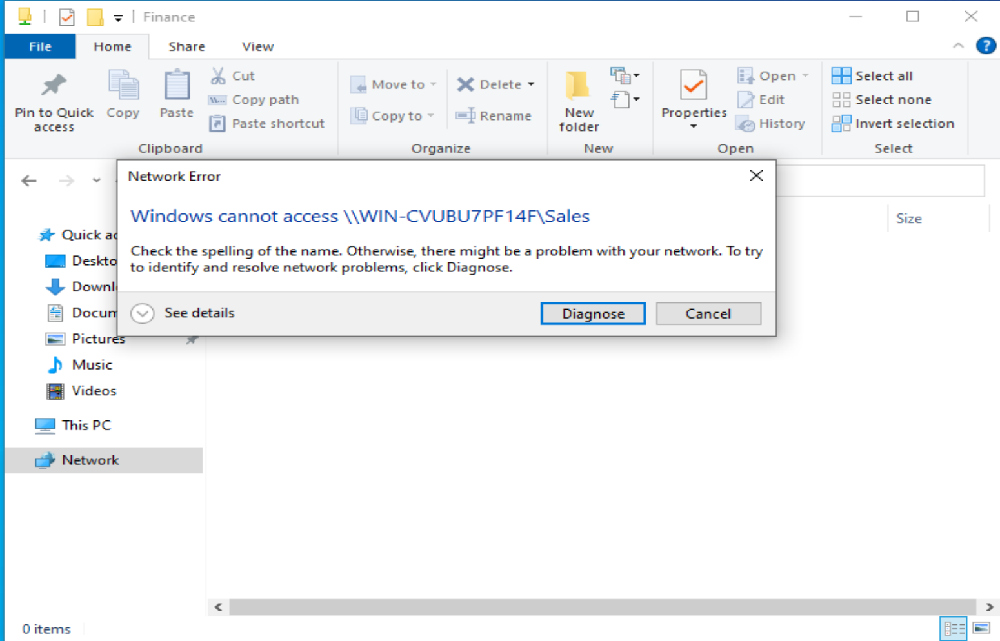

---

## Skills Demonstrated
- Active Directory administration
- Domain user provisioning
- PowerShell automation
- Organizational Unit design
- Security group management
- Role-based access control (RBAC)
- Windows file sharing
- NTFS permissions
- Access validation and troubleshooting
- VirtualBox lab setup

---

## Key Takeaways
This lab helped reinforce how Active Directory is used to structure users and manage access in a Windows domain environment. It also demonstrated the importance of combining organizational structure with group-based permissions to implement clean and scalable access control.

By the end of the project, I had built a functional AD lab that simulated:
- enterprise-style user administration
- department-based authorization
- shared resource access control
- practical Windows domain troubleshooting

---

## Resume Bullet Points
- Built a Windows Active Directory homelab with a Domain Controller and domain-joined client to simulate enterprise identity and access management
- Bulk-created 100 domain user accounts using PowerShell and organized them into department-based OUs and security groups
- Implemented role-based access control by assigning shared folder permissions through Active Directory security groups
- Configured and validated share-level and NTFS permissions to enforce authorized and unauthorized access scenarios across department resources
